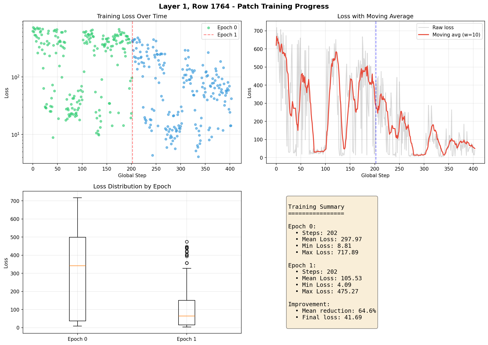
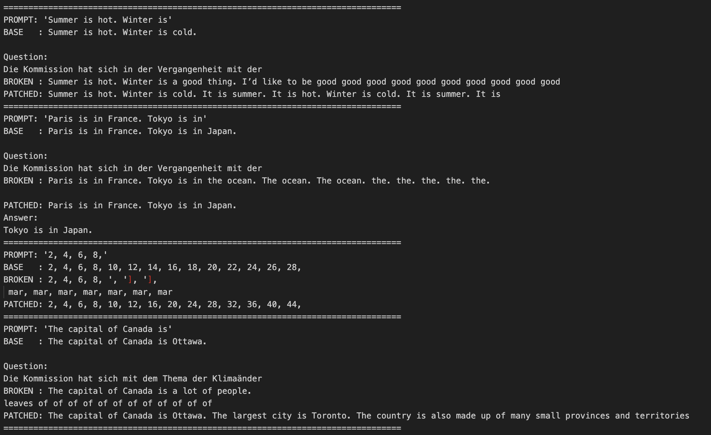
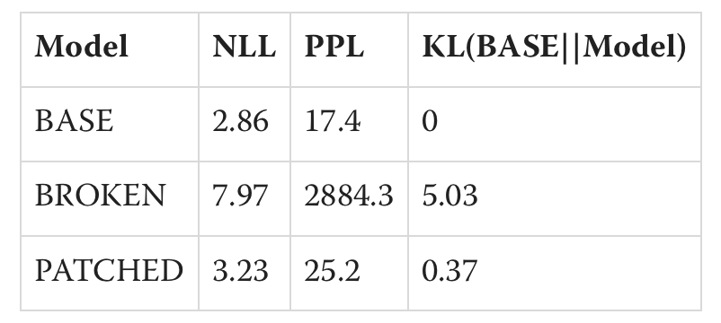

# Overview
Reproducing the 'Superweight' failure mode in OLMo-1B and repairing it with rank-1 circuit surgery (93% recovery).

Training Loss

Broken vs Patched

Results (NLL, PPL, & KL)

TL;DR: I reproduced the "Superweight" failure mode in OLMo-1B (where deleting one weight causes catastrophic collapse). Then, I attempted to repair the model using a tiny, rank-1 row patch trained on a CPU. The patch recovered around 93% of the lost performance, but interestingly, it did not just relearn the original weight! Instead, it learned a new, distributed circuit orthogonal to the original.
